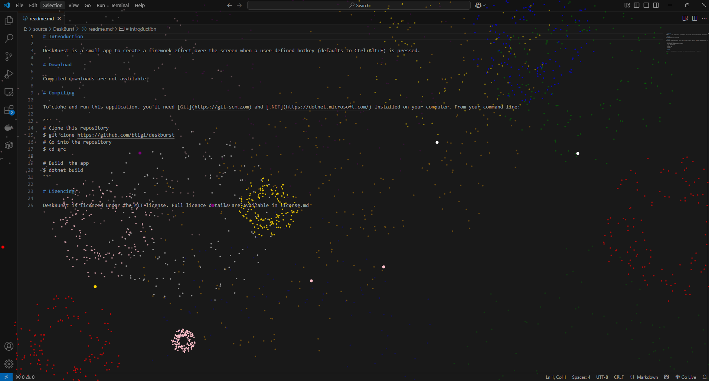

# Introduction

DeskBurst is a small app to create a firework effect over the screen when a user-defined hotkey (defaults to Ctrl+Alt+F) is pressed. Fireworks will end after 10 seconds, or when the hotkey is pressed.



# Download

Compiled downloads are not available.

# Compiling

To clone and run this application, you'll need [Git](https://git-scm.com) and [.NET](https://dotnet.microsoft.com/) installed on your computer. From your command line:

```
# Clone this repository
$ git clone https://github.com/btigi/deskburst
# Go into the repository
$ cd src

# Build  the app
$ dotnet build
```

# Licencing

DeskBurst is licenced under the MIT license. Full licence details are available in license.md